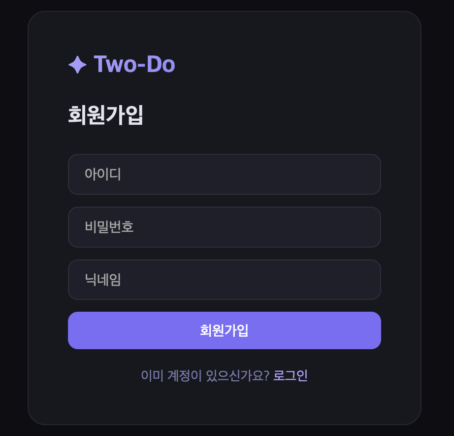
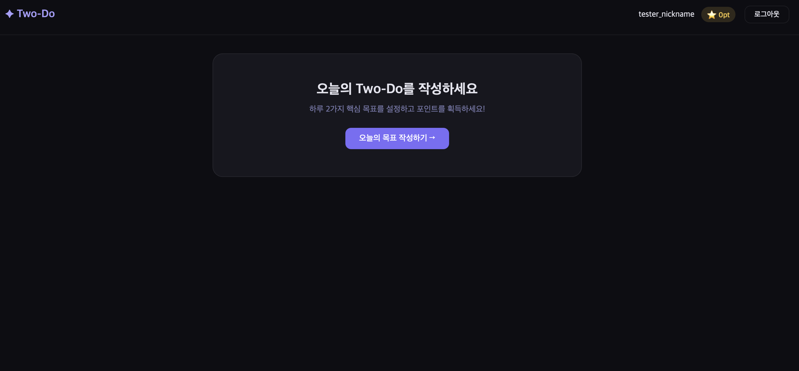
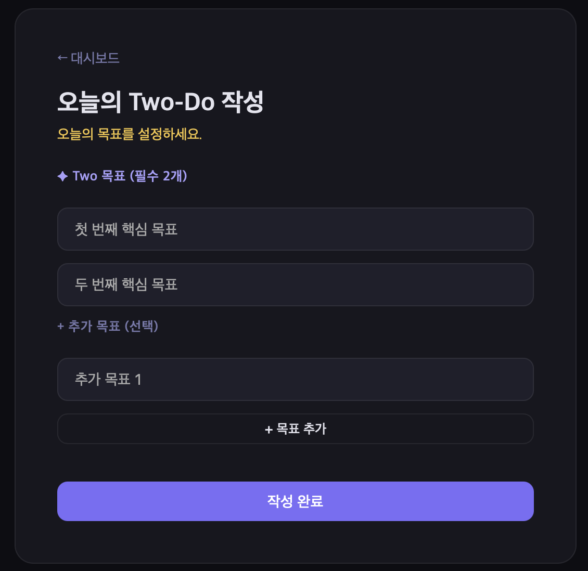
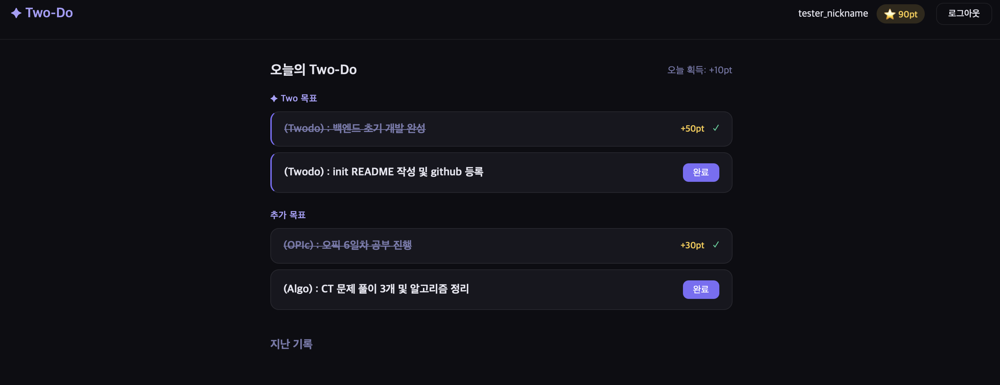
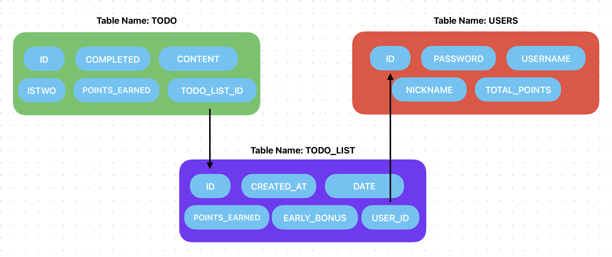

# ✦ Two-Do

> 하루 두 가지 핵심 목표에 집중하는 투두리스트 형식 웹 애플리케이션<br>


## 애플리케이션 개요 및 기능 소개

본 웹 애플리케이션은 사용자가 `todo` 리스트를 하루마다 작성하며 완료하는 형식의 학습 및 목표 성취 도움을 목적으로 합니다.<br>
`회원 기능`을 통해 개별 데이터를 저장하며, 특정 목적을 달성할 시 `리워드 포인트`를 받게 됩니다.

- ### 사용자 회원가입을 통해, 개인별 `Two-Do` 관리

<div style="display: flex; align-items: flex-start; gap: 20px;">

  

  <div>
    중복되지 않는 아이디와 닉네임을 설정하여 유저를 등록하여야 하며 등록된 정보는 서버 데이터베이스에 저장됩니다.


- `todo` 애플리케이션의 특성상 가볍고 빠른 사용자 체감을 위해, 회원가입 로직을 최대한 단순화 하였으며


- `Spring Security`기반의 세션 인증과, `BCrypt`를 통한 패스워드 암호화 과정을 거칩니다.


// 미개발 추가 구현사항

- // 비밀번호 재입력 기능 추가 예정


- // 카카오 및 구글 계정 로그인 기능 도입

  </div>

</div>

- ### 로그인 시 대시보드 페이지

<div style="display: flex; align-items: flex-start; gap: 20px;">

  

  <div>
    회원가입 이후, 첫 로그인을 수행하면 다음과 같은 페이지가 로드됩니다.


- 좌측 상단에 사용자의 닉네임과 보유한 `리워드 포인트`를 확인할 수 있으며


- 중앙부는 매일 새로운 목표를 작성할 수 있는 공간으로 구성되어 있습니다.


- 이전 날짜의 기록의 경우 페이지 하단에 추가되어 히스토리를 확인할 수 있습니다.  

// 미개발 추가 구현사항

- // 사용자 개인별 정보 조회 페이지 추가

 
- // 과거 `Two-Do` 히스토리 기반, 직관적인 히스토리 뷰 도입 

  </div>

</div>


- ### 오늘의 `Two-do` 작성

<div style="display: flex; align-items: flex-start; gap: 20px;">

  

  <div>
    오늘의 <code>Two-do</code>는 크게 <code>핵심 목표 2가지</code>와 <code>추가 목표들</code>로 구성됩니다.<br>


- 계획한 하루 일정 중 꼭 해내고자 하는 주요 목표를 <code>핵심 목표</code>로 필수 설정하여야 하며,<br>
- <code>추가 목표</code>는 선택사항으로 사용자 개인에 따라 동적으로 개수를 조절합니다.<br><br>

  <code>Two-Do</code> 작성 완료 시 <code>리워드 포인트</code> <code>10pts</code>를 받을 수 있습니다.<br>
  만약 <code>오전 10시</code> 이전에 작성하였다면, 추가로 <code>20pts</code>를 받을 수 있습니다.
 
</div>

</div>

- ### 오늘의 `Two-Do` 작성 이후 대시보드

<div style="display: flex; align-items: flex-start; gap: 20px;">

  

  <div>
    오늘의 <code>Two-do</code>가 페이지의 메인을 구성하며, 완료 버튼을 통해 개인 목표 달성을 체크합니다.


- 모든 목표는 완료 시 리워드 포인트 `30pts`를 지급합니다.


- <code>핵심 목표</code>는 `50pts`로 일반 목표보다 `20pts`가 추가 지급됩니다.


- 만약 <code>핵심 목표</code>를 2가지를 모두 완료하였다면, 추가로 `50pts`를 휙득합니다.


  </div>

</div>

---
## SpringBoot & Dependencies

| 항목 | 값 | 항목 | 값 |
|------|------|------|------|
| Group | `com.twodo` | Spring Boot | `4.0.5` |
| Artifact | `twodo` | Java | `21` |
| Package | `twodo` | Build | `Gradle - Groovy` |
| Packaging | `Jar` | Dependencies | `Spring Web`, `Spring Data JPA`, `H2 Database`, `Spring Security`, `Lombok`, `Thymeleaf` |


---

## 기술 스택

- **Backend**: Spring Boot 4.0.5, Spring Security, Spring Data JPA
- **Database**: H2 (인메모리)
- **Template Engine**: Thymeleaf
- **Utility**: Lombok
- **Build Tool**: Gradle

---

## 프로젝트 구조

```
src/main/
├── java/twodo/
│   ├── TwoDoApplication.java
│   ├── config/
│   │   ├── SecurityConfig.java
│   │   └── CustomUserDetailsService.java
│   ├── controller/
│   │   ├── MainController.java
│   │   ├── AuthController.java
│   │   └── TodoController.java
│   ├── model/
│   │   ├── User.java
│   │   ├── TodoList.java
│   │   └── Todo.java
│   ├── repository/
│   │   ├── UserRepository.java
│   │   ├── TodoListRepository.java
│   │   └── TodoRepository.java
│   └── service/
│       ├── UserService.java
│       ├── TodoService.java
│       └── PointService.java
└── resources/
    ├── application.properties
    ├── templates/
    │   ├── index.html
    │   ├── login.html
    │   ├── register.html
    │   ├── dashboard.html
    │   └── write.html
    └── static/
        └── css/
            └── style.css
```

---

## 핵심 기능

// 추가 작성 예정

---

## 페이지 라우팅

| URL | 설명 | 인증 필요 |
|-----|------|-----------|
| `GET /` | 메인 랜딩 (로그인 시 대시보드 이동) | X |
| `GET /login` | 로그인 페이지 | X |
| `POST /login` | 로그인 처리 (Spring Security) | X |
| `GET /register` | 회원가입 페이지 | X |
| `POST /register` | 회원가입 처리 | X |
| `GET /logout` | 로그아웃 | O |
| `GET /dashboard` | 메인 대시보드 | O |
| `GET /write` | 투두 작성 페이지 | O |
| `POST /write` | 투두 저장 | O |
| `POST /todo/{id}/complete` | 목표 완료 처리 | O |

---

## 데이터 모델



### User
| 필드 | 타입 | 설명 |
|------|------|------|
| id | Long | PK |
| username | String | 아이디 (unique) |
| password | String | BCrypt 암호화 |
| nickname | String | 닉네임 |
| totalPoints | int | 누적 포인트 |

### TodoList (하루치 Two-Do 정보)
| 필드 | 타입 | 설명           |
|------|------|--------------|
| id | Long | PK           |
| user | User | FK           |
| date | LocalDate | 작성 날짜        |
| createdAt | LocalDateTime | 정확한 작성 시각    |
| pointsEarned | int | 당일 획득 포인트    |
| earlyBonus | boolean | 10시 이전 작성 여부 |

### Todo (개별 목표)
| 필드 | 타입 | 설명 |
|------|------|------|
| id | Long | PK |
| todoList | TodoList | FK |
| content | String | 목표 내용 |
| isTwo | boolean | Two 목표 여부 |
| completed | boolean | 완료 여부 |
| pointsEarned | int | 획득 포인트 |

---

## 주요 구현 사항

- `CustomUserDetailsService` — Spring Security `UserDetailsService` 구현체
- `SecurityConfig` — CSRF 비활성화, 정적 리소스 및 인증 페이지 허용
- `TodoService.createTodoList()` — 하루 1회 제한, Two 목표 2개 검증, 작성 시각 기반 조기 `Two-Do` 작성 보너스 자동 적용
- `TodoService.completeTodo()` — `Two` 목표 전체 완료 시 보너스 자동 지급
- `MainController` — 로그인 상태 감지 후 대시보드 리다이렉트 처리

---

## 발생 문제 및 해결 과정

### - 문제 : `todoList` 객체 : 각 개별 `todo` 완료 시 점수 추가되지 않는 문제 발생
> 관련 키워드 : `FetchType.LAZY` `Proxy` `JPA` `persistence context`

`todo`의 집합인 `todoList`에서 당일 전체 휙득 점수를 저장하도록 설계하였지만, 반영이 안되는 문제가 발생하였다.<br>
확인 결과 `todo`를 통한 휙득 점수가 `todoList`에서 연산 적용이 안되었기에

```java
private void addPointsToTodoList(TodoList todoList, int pts) {
    todoList.setPointsEarned(todoList.getPointsEarned() + pts);
    todoListRepository.save(todoList);
}
```

내부 `private` 멤버 메서드 `addPointsToTodoList`를 선언하여, 활용하도록 추가하였다.

```java
// todoService: completeTodo 메서드 일부
...
userService.addPoints(user, pts);
addPointsToTodoList(todo.getTodoList(), pts);  // 추가

if (todo.isTwo()) {
    List<Todo> twoDos = todoRepository.findByTodoListAndIsTwo(todo.getTodoList(), true);
    boolean allDone = twoDos.stream().allMatch(Todo::isCompleted);

    if (allDone) {
        userService.addPoints(user, PointService.TWO_ALL_DONE_BONUS);
        addPointsToTodoList(todo.getTodoList(), PointService.TWO_ALL_DONE_BONUS); // 추가
    }
}
...
```

그러나 위와 같은 방식으로 변경한 이후, `allDone`의 경우, `addPointsToTodoList`메서드가 반영이 안되는 문제가 발생하였다.<br>

```java
@ManyToOne(fetch = FetchType.LAZY)
@JoinColumn(name = "todo_list_id")
private TodoList todoList;
```

`Todo` 클래스의 `todoList`는 `LAZY`로 패치타입이 설정되어 있다. 따라서 `todoRepository.findById(todoId)`로 `Todo`를 가져올 때<br>
`todo.getTodoList()`는 실제 객체가 아닌 `프록시`이다.

따라서 해당 프록시를 매개변수로한 `addPointsToTodoList()` 메서드에서 실행된 메서드들은 `DB`에 반영이 안된 것이다.

정확히 하자면, `todo.getTodoList()`는 프록시지만, 프록시도 실제 데이터에 접근하는 순간 초기화되어 정상 작동한다.<br>
그러나 사이에 `save()`, `findBy..()`와 같은 다른 `DB`작업이 수행되며 영속성 컨텍스트의 상태가 달라져 두번째 호출이 불안정해진 것이다.

따라서 매개변수로 `todo.getTodoList()`가 아닌

```java
TodoList todoList = todoListRepository.findById(todo.getTodoList().getId())
                .orElseThrow(() -> new RuntimeException("투두리스트를 찾을 수 없습니다."));
```

미리 실제 객체를 받아온 `todoList`를 매개변수로 동일 객체에 접근하게 하여 안정적으로 `DB`에 반영되도록 하였다.